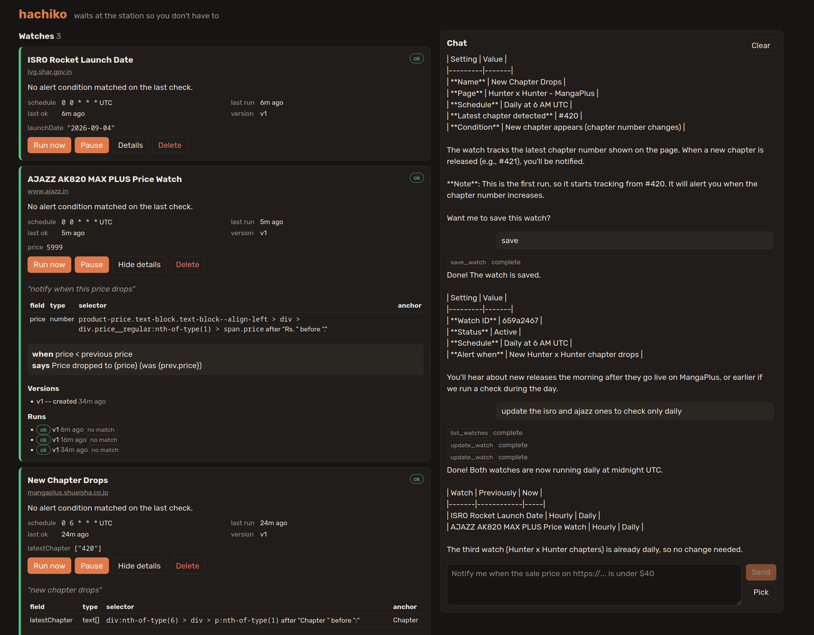
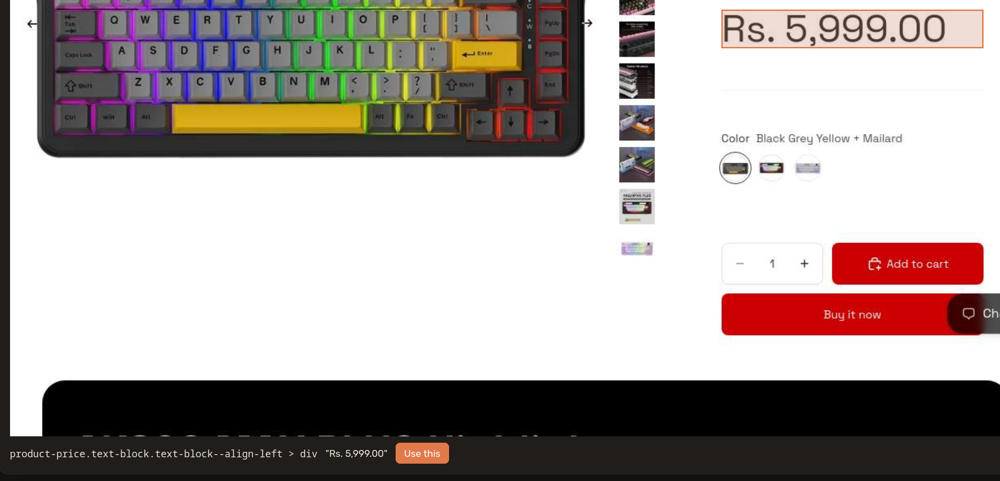

# hachiko

Lets users create and schedule arbitrary webpage watchers.

Users submit queries related to their watches (CRUD) on a chatbox that is interpreted by an orchestrator LLM agent.

Watches can be arbitrary, including arbitrary conditions ("notify me when product X has a sale price less than Y", "notify me when the ISRO rocket launch date on https://lvg.shar.gov.in/VSCREGISTRATION/index.jsp is updated and is in the future").

## How it works

The user intent is compiled into a deterministic, declarative query: CSS or XPath selectors, a type for each value (text, number, date, exists), optional literal `after` / `before` markers, and a condition such as "price < 300" or "launch date changed and is after today". It is saved as a durable watch and cron.

After that, routine checks never call a model. A scheduled check loads the page, reads the values, and evaluates the condition.

Watchers are self-healing, so if the upstream changes format, we don't silently fail. A check notices the change and tries to find the moved values again. If it can't, it reports itself broken. A broken selector is never reported as "condition not met".

The user experience includes a simple UI to see / manage existing watches. Users can also select a component on a web page to steer the agent.

## Screenshots

Create watches using chat and manage them on the UI:

Manually select:


## Stack

| piece | Cloudflare product | does |
| --- | --- | --- |
| `Hachiko` agent | Durable Objects (Agents SDK) | per-user chat, watch registry, cron, notifications |
| `CheckWorkflow` | Workflows | one durable, retryable run per check: observe, evaluate, heal, record |
| scraper | Browser Run | loads pages, reads selectors, screenshots for the picker |
| condition evaluator | Workers (in-process) | declarative condition, type-checked on save; no code runs |
| models | Workers AI | orchestrator, compiler (sentence to spec), healer |

More in [docs/design.md](docs/design.md), [docs/spec.md](docs/spec.md) and [docs/resources.md](docs/resources.md).

## Setup

Needs Node.js 20+, pnpm, and a Cloudflare account. Everything runs on the **Workers Free** plan: Workers, Durable Objects (SQLite), Workflows, Browser Run and Workers AI all have free tiers, and the default models do not require paid billing. Chromium is only needed for the browser tests.

```sh
pnpm install
pnpm approve-builds              # allow esbuild/workerd install scripts if prompted
pnpm exec wrangler login         # or set CLOUDFLARE_API_TOKEN and CLOUDFLARE_ACCOUNT_ID
```
```sh
# Set webhook for deployment (discord-compatible)
pnpm exec wrangler secret put NOTIFY_WEBHOOK_URL
```

## Usage

```sh
pnpm dev                              # http://localhost:5173 (needs Cloudflare auth for Workers AI)
CLOUDFLARE_ENV=offline pnpm dev       # everything except the models, no auth needed
pnpm test
pnpm typecheck
pnpm run deploy                       # not `pnpm deploy`, that's a pnpm built-in
pnpm types                            # after editing wrangler.jsonc
```

- **Create a watch:** ask in the chat. The agent compiles it, dry-runs it against the live page, and shows a draft to approve.
- **Steer with the picker:** click **Pick**, load a URL, click the element, then **Use this**.
- **Manage:** Run now, Pause/Resume, Details, Delete on each card, or ask the chat.
- **Notifications** go to the inbox, the chat, and `NOTIFY_WEBHOOK_URL` if set.


Offline mode has no chat, but `testSpec(spec)` and `createFromSpec({ name, intent, cron, spec })` work over the agent's RPC with a hand-written spec.

## Config

| name | where | default |
| --- | --- | --- |
| `ORCHESTRATOR_MODEL` | `wrangler.jsonc` var | `@cf/zai-org/glm-4.7-flash` (needs function calling; free tier) |
| `COMPILER_MODEL` | `wrangler.jsonc` var | `@cf/meta/llama-3.3-70b-instruct-fp8-fast` (needs JSON mode; free tier) |
| `NOTIFY_WEBHOOK_URL` | secret | unset, Discord-compatible, gets `{ "content": "..." }` |
| `CLOUDFLARE_ENV` | shell | `offline` skips models |
| `CHROMIUM_PATH` | shell | `/usr/bin/chromium`, browser tests skip if missing |

Some Workers AI models need paid billing even on the Free plan (`kimi-k2.6`, `glm-5.x`, `deepseek-v4-*`); keep to models without that note if you swap them.

Locally, copy `.dev.vars.example` to `.dev.vars`. In production: `pnpm exec wrangler secret put NOTIFY_WEBHOOK_URL`.

## Auth

None yet. The UI connects to a single agent instance named `me`, so anyone who can reach a deployment can use it. Put it behind Cloudflare Access, or add auth, before deploying publicly.

## Layout

```
src/server/   agent, workflow, browser, extraction, condition, compiler, limits
src/client/   React UI (Vite)
test/         vitest unit tests and HTML fixtures
docs/         design notes, spec, references
```
